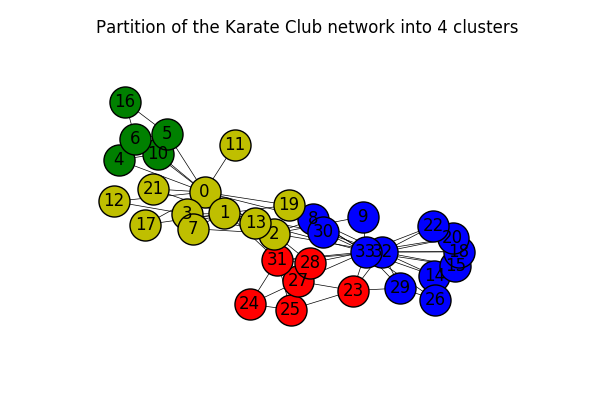

# Computing communities in large networks using random walks
I replicated the method presented in "Computing communities in large networks using random walks" by Pons et. al for an assignement.

The method is then evaluated on various graph datasets.

The results are presented in a report [link](report.pdf)

Example output for the Karate club network:

